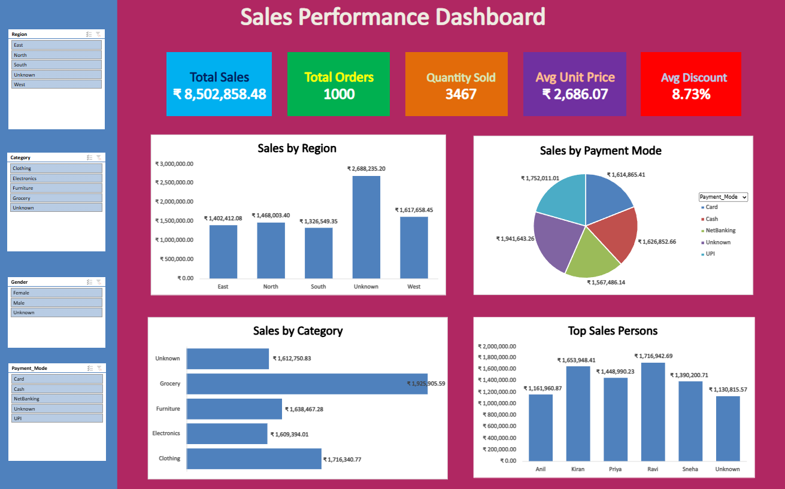

# Sales-Performance-Dashboard-Excel
Interactive Sales Dashboard built using Microsoft Excel 365 with Pivot Tables, KPI Cards, and Slicers for business insights.
Sales-Performance-Dashboard-Excel

Project Overview

Interactive Sales Dashboard built using Microsoft Excel 365 to analyze sales performance and generate business insights.

Tools Used

- Microsoft Excel 365
- Pivot Tables
- KPI Cards
- Slicers

Key Metrics

- Total Sales
- Total Orders
- Quantity Sold
- Average Unit Price
- Average Discount

Features

- Interactive Dashboard
- Data Cleaning
- KPI Tracking
- Data Visualization

Objective

To transform raw sales data into meaningful insights and support data-driven decision making.

## Dashboard Preview

